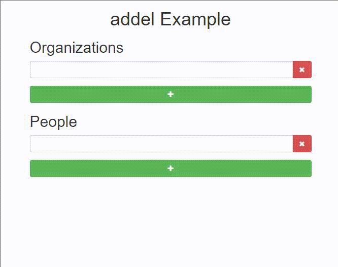

addel is a simple and lightweight jQuery plugin for powering UIs that enable dynamic addition and deletion of HTML elements, conceived with form elements in mind.

"addel" is short for add-delete and should be pronounced "Adele", just like the singer's name.

..Because it's all in the details, people!


## Table of Contents

- [Notable Features](#notable-features)
- [Installation](#installation)
- [Initialization](#initialization)
- [HTML structure & restrictions](#html-structure--restrictions)
- [Options](#options)
  - [Options example](#options-example)
  - [Data-attributes](#data-attributes)
    - [Data-attributes example](#data-attributes-example)
  - [Defaults](#defaults)
- [Events](#events)
  - [Events example](#events-example)
- [Example](#example)
- [Browser support](#browser-support)
- [Release policy](#release-policy)
- [License](#license)


## Notable features

- Lightweight
- Maximum HTML flexibility
- Events you can hook on
- Declarative control
- Keyboard convenience through smart focusing
- Customizable animation


## Installation

There are multiple options:

- Download [addel.jquery.js](addel.jquery.js) or [addel.jquery.min.js](addel.jquery.min.js)
- Use [Bower](https://bower.io/): `bower install addel --save`
- Use [npm](https://www.npmjs.com/): `npm install addel --save`
- Use [yarn](https://yarnpkg.com/): `yarn add addel`

And include it:
`<script src="/path/to/file/addel.jquery.min.js"></script>`


## Initialization

```javascript
$('.addel-container').addel({
    // optional options object
});
```


## :warning: HTML structure and restrictions

```html
<div class="addel-container">
    <div class="addel-target">
        <button class="addel-del"></button>
    </div>
    <button class="addel-add"></button>
</div>
```
As per [RFC 2119](https://www.ietf.org/rfc/rfc2119.txt):
* `.addel-container` **MUST** be the element addel is initialized upon
* `.addel-container` **MUST** contain everything else: `.addel-target`, `.addel-delete` and `.addel-add`
* `.addel-target` **MAY** also contain your own element/s, this is after all what we are here for
* `.addel-delete` **MUST** be `.addel-container`'s and `.addel-target`'s descendant
* `.addel-add` **MUST** be `.addel-container`'s descendant and **MUST NOT** be `.addel-target`'s descendant

Note that class names are for reference only and are completely customizable, as described in the [options section](#options).


## Options

Name|Type|Default|Info
----|----|-------|----
`hide`|`boolean`|`false`|Whether to initially hide the `target` (disables its form elements)
`add`|`integer`|`1`|The number of `target`s clicking `classes.add` will add to the DOM
`classes.target`|`string`|`addel-target`|The class name of the element to be dynamically `addeled`™
`classes.add`|`string`|`addel-add`|The class name of the element that adds a `target` on click
`classes.delete`|`string`|`addel-delete`|The class name of the element that deletes a `target` on click
`classes.deleting`|`string`|`addel-delete`|The class name to be added to any `target` that is currently being deleted
`animation.duration`|`integer`|`0`|The animation's duration (in milliseconds) when `addeling`™ 
`animation.easing`|`string`|`swing`|The animation's easing when `addeling`™
`events.add`|`callback`|-|Detailed in the [events section](#events)
`events.added`|`callback`|-|Detailed in the [events section](#events)
`events.delete`|`callback`|-|Detailed in the [events section](#events)
`events.deleted`|`callback`|-|Detailed in the [events section](#events)

* For more information on `animation.duration` and `animation.easing`, see jQuery's [`.fadeIn()`](http://api.jquery.com/fadein/) and [`.fadeOut()`](http://api.jquery.com/fadeout/).
* Note that it is possible to set the `add` option per element using a data-attribute, as described in the [data-attributes](#data-attributes) section.

### Options example

```javascript
$('.people').addel({
    hide: true,
    add: 2,
    classes: {
        target: 'person',
        add: 'btn-add',
        delete: 'btn-del'
    },
    animation: {
        duration: 300,
        easing: 'linear'
    }
});
```

### Data-attributes
Some options can be set declaratively as data-attributes on the HTML elements:

Option|Data-attribute equivalent|Placement
------|-------------------------|---------
`hide`| `data-addel-hide`|container
`add`| `data-addel-add="<number>"`|container
|`classes.target`| `data-addel-target`|target
`classes.add`| `data-addel-add` or `data-addel-add="<number>"`|add
`classes.delete`| `data-addel-delete`|delete
`animation.duration`| `data-addel-animation-duration`|container
`animation.easing`| `data-addel-animation-easing`|container

* Setting `data-addel-add` is the same as setting `data-addel-add="1"`.
* Setting `data-addel-add="5"` on `.addel-container` will make all `.addel-add` / `data-addel-add` elements inside of it add 5 `target`s on click, by default.
* Specifying in addition a `data-addel-add="10"` on a specific `.addel-add` / `data-addel-add` will make that _specific_ element add 10 `target`s, overriding the default 5 set earlier on the container.
* Note that for elements to behave as buttons that add `target`s, you need to add _either_ `data-addel-add` _or_ `data-addel-add="<number>"` to the element, there's no need for both.

#### Data-attributes example
```javascript
<div class="addel" data-addel-hide="true" data-addel-add="2">
    <div data-addel-target>
        <button data-addel-delete></button>
    </div>
    <button data-addel-add="1"></button>  // adds 1 data-addel-target, as expected
    <button data-addel-add></button>      // adds 2 data-addel-target due to default set on .addel
    <button data-addel-add="3"></button>  // adds 3 data-addel-target on click, as expected
</div>
<script>
    $(function() {
        $('.addel').addel();
    });
</script>
```

### Defaults
Override the entire options object:
```javascript
$.fn.addel.defaults = {
    // options
};
```

Or a specific option:
```javascript
$.fn.addel.defaults.option = value;
```


## Events

Event|Triggered when...|Exposes
-----|-----------------|-------
`addel:add`|`add` is clicked|`event.target`
`addel:added`|`target` is added to the DOM|`event.target`, `event.added`
`addel:delete`|`delete` is clicked|`event.target`
`addel:deleted`|`target` is removed from the DOM|`event.target`

All events are triggered on the element addel is initialized upon (AKA `container`).

### Events example
Ask for confirmation before deleting:
```javascript
$('.addel-container').addel({
    
    // other options

    events: {
        delete: function (event) {
            if (!window.confirm('Are you absolutely positively sure?')) {
                event.preventDefault();
            }
        }
    }
});
```

Or bind the event yourself:
```javascript
$('.addel-container').addel({
    // other options
})
.on('addel:delete', function (event) {
    if (!window.confirm('Are you absolutely positively sure?')) {
        event.preventDefault();
    }
});
```


## Example

A more elaborate [example](example.html) of all of the above is included.


## Dependencies

jQuery (v2-3).


## Browser support

addel is developed using Chrome (v55). It should work properly on all evergreen browsers and IE9+.


## Release policy

addel adheres to [Semantic Versioning](http://semver.org/).


## License

addel is released under the [MIT license](https://github.com/legshooter/addel/blob/master/LICENSE).